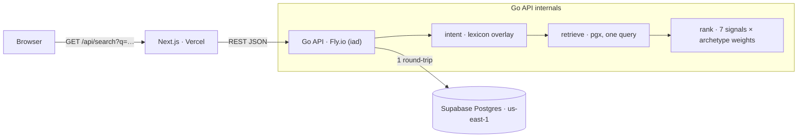
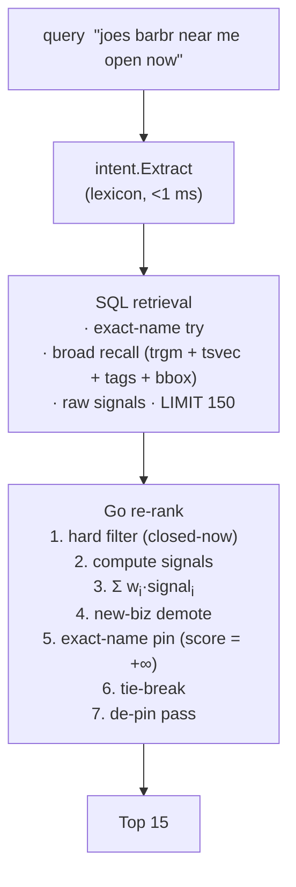

<div align="center">


# Lemon Search

**Discover, compare, and book any service in your city — all from one app.**

Typo-tolerant, ranked search over Lemon's Miami business catalog.
Sub-100ms p95, 7-signal ranking with archetype-aware weights, lexicon-driven semantic intent.

[Live demo](#) · [Docs index](docs/README.md) · [Writeup](docs/writeup.md) · [Architecture](docs/architecture.md) · [Roadmap](docs/roadmap/00-overview.md) · [API](docs/api.md) · [Development](docs/development.md)

[](https://github.com/danielreales00/lemon-search/actions/workflows/ci.yml)
[](api/go.mod)
[](web/package.json)
[](supabase/migrations)

</div>

---

## What this is

A four-day build trial for [Lemon](https://uselemon.com/). The whole project is a single
slice of what would be the first thing you'd own at Lemon: the engine that takes a query
and returns the right local businesses, ranked well.

The grading rubric is search quality, ranking quality, speed, judgment. The visible UI is
deliberately thin — a single search bar — because the engine is what matters.

## TL;DR

- **23,537 Miami businesses** ingested from Lemon's catalog.
- **Stack**: Go API on Fly.io (`iad`) · Supabase Postgres (`us-east-1`) · Next.js on Vercel.
- **Search engine**: Postgres `pg_trgm` + weighted `tsvector` + GIN on tag arrays + `earthdistance`.
- **Ranking**: 7 signals × 6 archetype-weighted linear sum, per the spec. Two alternative formulas (Bayesian rating, decay distance) live behind config switches so we can compare results without silent deviation.
- **Sub-100ms p95** end-to-end measured under load.
- **Daily commits, daily progress notes** under [`docs/progress/`](docs/progress).

## Architecture at a glance





The full architectural rationale (which patterns earn their place against the spec, which
were considered and rejected) lives in [`docs/architecture.md`](docs/architecture.md).

## Stack

| Layer | Choice | Why |
|---|---|---|
| Frontend | Next.js 15 (App Router, React 19), Vercel | Spec stack; static + edge runtime; small surface |
| API | Go 1.23, `pgx/v5`, `slog`, Fly.io | Strong types, single binary, ergonomic backend; same-region with Supabase |
| Database | Supabase Postgres 15, `pg_trgm`, `cube`, `earthdistance` | Spec deliverable; one engine for text + geo + filters at 23k rows |
| Ranking | Go + YAML (`config/ranking.yaml`) | Testable in isolation; config-driven |
| Hooks | [lefthook](https://github.com/evilmartians/lefthook) | Single binary, fast, Go + JS friendly |
| CI | GitHub Actions | Lint, test, build, migrations-idempotency on every PR |
| Deploy | Fly.io (API) + Vercel (FE) | Same-region pairing keeps Go ↔ DB hop ≤ 10ms |

## Quick start

Prereqs: Go ≥ 1.23, Node ≥ 20, Docker (for local Postgres), Supabase CLI, lefthook.

```bash
# Clone + hooks
git clone https://github.com/danielreales00/lemon-search.git
cd lemon-search
lefthook install                          # pre-commit + pre-push

# Env
cp .env.example .env.local

# Database (local)
supabase start
psql "$LEMON_DATABASE_URL" -f supabase/migrations/0001_initial_schema.sql

# Ingest (drop the JSON file at repo root, then)
cd api && go run ./cmd/ingest -input ../businesses-2026-05-27.json && cd ..

# Run the API
cd api && go run ./cmd/api &
cd ..

# Run the FE
cd web && npm install && npm run dev
```

Open <http://localhost:3000>, type a query.

## Project layout

```
├── api/                  Go service (one module, two binaries)
│   ├── cmd/api/          HTTP server
│   ├── cmd/ingest/       JSON → Postgres ingestion CLI
│   ├── internal/
│   │   ├── api/          HTTP transport (handlers, encoders)
│   │   ├── config/       YAML loader
│   │   ├── domain/       Types + Repo port (no I/O)
│   │   ├── intent/       Lexicon-driven query intent extraction
│   │   ├── observ/       Structured logging + timing
│   │   ├── rank/         7-signal scorer with archetype weights
│   │   └── retrieve/postgres/   Supabase adapter
│   ├── .golangci.yml     Strict lint config
│   ├── Makefile          fmt, lint, test, build
│   └── go.mod
├── web/                  Next.js 15 frontend
│   ├── app/              App Router pages
│   ├── components/       SearchBar, ResultsList
│   ├── lib/              Typed API client
│   ├── .eslintrc.json    Strict TS + import-order
│   ├── .prettierrc.json
│   └── tsconfig.json     Strict mode + noUncheckedIndexedAccess
├── supabase/
│   └── migrations/       Versioned SQL migrations
├── config/
│   └── ranking.yaml      Archetype weights + formula switches
├── bench/
│   └── queries.json      Curated 30-query benchmark
├── docs/
│   ├── README.md         Docs index (start here)
│   ├── architecture.md   Patterns adopted + topology diagram
│   ├── development.md    Quality stack, hooks, conventions
│   ├── glossary.md       Terms used across docs
│   ├── api.md            HTTP endpoint contract
│   ├── writeup.md        Final writeup (drafted Day 4)
│   ├── roadmap/          Per-stage specs (00-overview … 05-contracts)
│   ├── data/             schema · quality · taxonomy · ingestion
│   ├── ranking/          semantics (the math) · intent (the lexicon)
│   ├── operations/       deployment runbook · observability
│   ├── adr/              Architecture Decision Records (0001-0005)
│   └── progress/         Daily build notes (template)
├── scripts/              bench-runner, loadtest helper
├── .github/
│   ├── workflows/        ci.yml, deploy-api.yml
│   ├── dependabot.yml
│   └── PULL_REQUEST_TEMPLATE.md
├── lefthook.yml          Pre-commit + pre-push
└── fly.toml              Fly.io app config (added Stage 1)
```

## Ranking — spec-faithful by default, alternatives by config switch

The spec contract: every result is scored by 7 signals (each normalized 0–1) ×
an archetype weight, summed for a final score. Six archetypes. We honor that
exactly.

```yaml
# config/ranking.yaml (excerpt)
signal_formulas:
  rating: literal       # spec: lemon_score / 10
  distance: literal     # spec: max(1 - d/30mi, 0)

archetypes:
  high_stakes_one_time:    # weddings, contractors, photographers, …
    weights:
      distance: 0.04
      rating: 0.20
      popularity: 0.18
      friends: 0.16
      claimed: 0.25        # ← the "big boost for claimed" the spec describes
      photos: 0.15
      open_status: 0.02
    open_status: ignore
```

Two alternative signal formulas are implemented and reachable via the same
config (`signal_formulas.rating: bayesian`, `signal_formulas.distance: decay`).
They are **off by default**. The bench runner exercises both modes and writes
a side-by-side comparison into the writeup. Where the spec is unambiguous, we
honor the contract; where it's ambiguous, we flag the call openly.

Full decision log — what we did, what we rejected, why — in
[`docs/architecture.md`](docs/architecture.md). The 13 ranking decisions and
the alternatives we considered for each are in the linked plan file.

## Performance

| Stage | Budget | Notes |
|---|---|---|
| Browser → Vercel | < 30ms | TLS + cold fetch worst case |
| Vercel → Fly (iad) | ≤ 25ms | Same region |
| Go API processing | ≤ 10ms | Intent + handler + JSON encode |
| Fly → Supabase (us-east-1) | ≤ 10ms | Same region, prepared statement |
| SQL (retrieval + signals) | ≤ 25ms | GIN/GIST indexes + LIMIT 150 |
| Go re-rank | ≤ 5ms | Pure CPU over ≤150 candidates |
| **End-to-end p95 target** | **< 100ms** | Measured nightly in `bench/loadtest-*.md` |

Per-request timings are recorded in the API response under `timings.*` so the
bench runner can isolate stage breakdowns.

## Development workflow

Full guide: [`docs/development.md`](docs/development.md). Quick version:

```bash
# fast (pre-commit, changed files only)
git commit -m "feat(rank): hard-pin exact-name path"
#  → commitlint · gofumpt · golangci-lint fast · go-arch-lint · eslint+prettier
#    · madge cycles · markdownlint · gitleaks staged · big-file/env guards

# full (pre-push)
git push
#  → golangci-lint full · go-arch-lint full · go test -race · go build
#    · tsc · eslint full · knip (dead code) · gitleaks history

# CI mirrors pre-push and adds:
#  · migrations-idempotency · web build · secrets-scan · PR commitlint · markdownlint
```

Quality gates (full list in [`docs/development.md`](docs/development.md)):

| Category | Tooling |
|---|---|
| Correctness | golangci-lint (errcheck, staticcheck, govet, errorlint, bodyclose, sqlclosecheck, …) · TS strict-type-checked |
| Complexity | gocyclo · gocognit · funlen · nestif · cyclop · sonarjs/cognitive-complexity · ESLint complexity/max-depth |
| Dead code | Go `unused` + `unparam` · TS `knip` (files/exports/deps) |
| Drift | `go-arch-lint` (9 components, explicit deps) · `depguard` baseline · `eslint-plugin-boundaries` (app/component/lib) |
| Duplication | `dupl` · `goconst` · `sonarjs/no-duplicate-string` · `sonarjs/no-identical-functions` |
| Cycles | Go `staticcheck` · TS `import/no-cycle` + `madge --circular` |
| Secrets | `gitleaks` (staged + history + CI) with project rules for Supabase JWT and Fly tokens |
| Convention | `commitlint` (conventional commits, project-specific types/scopes) · `markdownlint-cli2` |

Architectural boundaries (locked in `api/.go-arch-lint.yml` and
`web/.eslintrc.json`):

```
api/internal/  domain (pure) · config (→domain) · intent (→domain)
               rank (→domain, config) · retrieve/postgres (→domain + pgx)
               observ (leaf) · api (→all) · cmd/* (composition roots)
web/           app (→app, component, lib) · components (→component, lib) · lib (leaf)
```

Violations fail the hook or CI. `--max-warnings=0` everywhere.

## Testing + bench

- **Unit tests**: `cd api && make test`. Ranker tested against fixture
  candidate slices; intent extractor against lexicon fixtures.
- **Bench**: `bench/queries.json` is a curated set of 30 queries (typo,
  prefix, category, intent, exact-name, new-biz, edge cases). Run with:
  ```bash
  go run ./scripts/bench-runner
  ```
  Outputs `bench/results-<date>.json` and a markdown summary. Run nightly.

## Roadmap

| Stage | Day | Theme | Spec |
|---|---|---|---|
| 1 | Day 1 | Foundation: schema, ingestion, skeletons deployed | [01-foundation.md](docs/roadmap/01-foundation.md) |
| 2 | Day 2 | Search core: retrieval + ranker online | [02-search-core.md](docs/roadmap/02-search-core.md) |
| 3 | Day 3 | Intent + polish + perf | [03-intent-polish.md](docs/roadmap/03-intent-polish.md) |
| 4 | Day 4 | Writeup + ship | [04-writeup-ship.md](docs/roadmap/04-writeup-ship.md) |

## Credits

Built against [Lemon's](https://uselemon.com/) 4-day search trial. Logo and
tagline are © Lemon and used here only to identify the project context.
