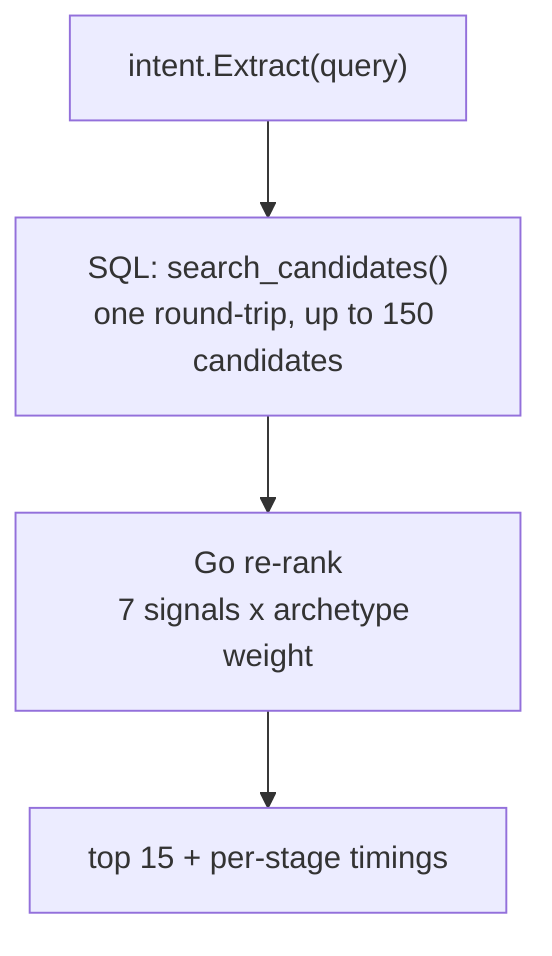
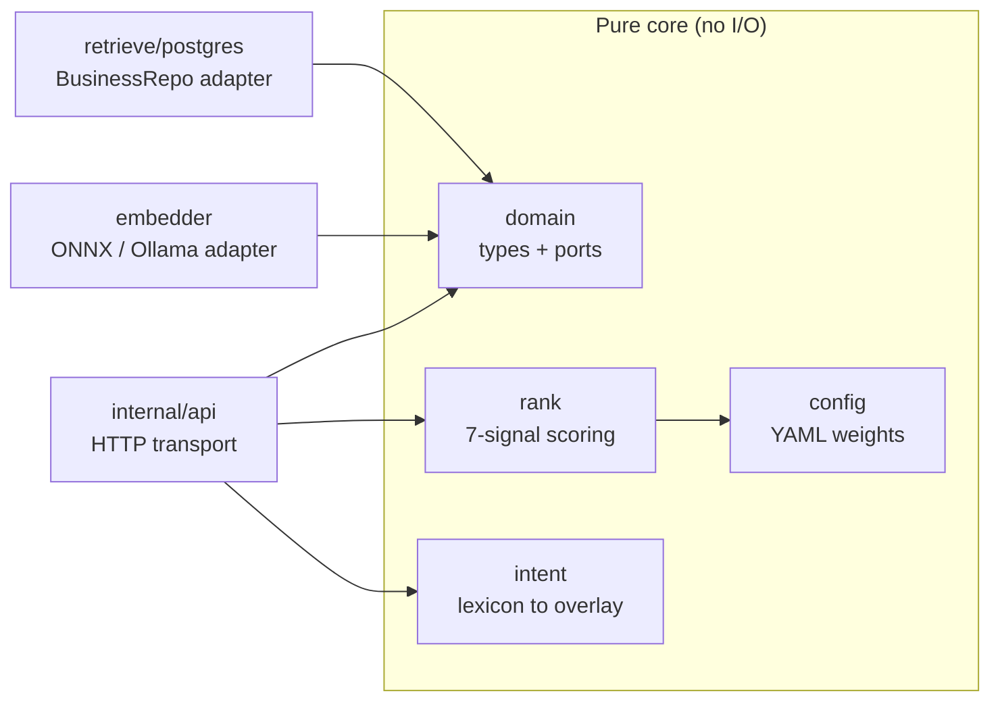

This page is for engineers. It explains how the system is structured, the two
patterns that do most of the work, and the reasoning behind the stack. Every
choice here is recorded in an Architecture Decision Record (ADR) in the repo,
linked inline.

## The two load-bearing patterns

### Two-phase retrieval

A search request is split into a wide recall phase (SQL) and a precise scoring
phase (Go).



The seam: **SQL returns rich raw signals; Go composes them into the score.** The
recall query handles text relevance, geo distance, intent filters, and semantic
recall, then hands back raw facts (distance, review count, photo count, open
status, and so on). It does no scoring. The Go ranker reads those facts and
produces the final order. This keeps the scoring logic pure and unit-testable
against fixture candidates with no database in the loop. See
[ADR-0003](https://github.com/danielreales00/lemon-search/blob/main/docs/adr/0003-ranking-strategy.md).

### Hexagonal core (ports and adapters)

The Go service has a pure center and thin edges. The center (domain types,
ranking, intent) knows nothing about HTTP or Postgres. The edges (the Postgres
adapter, the HTTP transport, the embedder) plug into the center through small
interfaces called ports.



The key port is `domain.BusinessRepo`. The ranker consumes it but never imports
the database driver. This is what lets a different search engine (a Meilisearch
adapter, for example) slot in without touching the ranking math. The boundaries
are not aspirational: they are enforced at commit time by `go-arch-lint` and
`depguard`, and the `domain` package is forbidden from importing even the
Postgres driver. See
[ADR-0005](https://github.com/danielreales00/lemon-search/blob/main/docs/adr/0005-hex-architecture.md).

<Note>
The package layout mirrors this. `domain` is pure types and ports. `rank` and
`intent` are pure use-cases. `retrieve/postgres` is the only adapter that touches
the database. `cmd/api` and `cmd/ingest` are the composition roots: the only
places that construct dependencies and wire everything together.
</Note>

## The stack

<CardGroup cols={3}>
  <Card title="Go API on AWS EC2" icon="server">
    The retrieval-and-ranking core plus an in-process embedding model, on a
    c7i.xlarge in us-east-1.
  </Card>
  <Card title="Supabase Postgres" icon="database">
    Postgres 15 with pg_trgm, earthdistance, and pgvector, in us-east-1, holding
    all state.
  </Card>
  <Card title="Next.js on Vercel" icon="window">
    A thin search bar with results as you type, deployed to Vercel's edge.
  </Card>
</CardGroup>

### Why these choices

<AccordionGroup>
  <Accordion title="Why Postgres for search, not Algolia or Meilisearch">
    At roughly 23,000 rows, index design and hop count decide whether we hit
    100ms, not the choice of engine. Postgres already holds the data, so using it
    for search collapses two systems into one with no sync pipeline and no second
    source of truth. It covers the spec's typo bar with `pg_trgm` plus a weighted
    `tsvector`, handles geo with `earthdistance`, and gives full SQL control over
    the raw signals the ranker needs.

    This was validated, not asserted: a measured 726-case head-to-head against a
    properly tuned Meilisearch had them **tied at 86% overall**, with different
    strengths (Postgres wins typo recall, Meilisearch wins partial-name and raw
    speed). Postgres was chosen for single-system simplicity under a four-day
    budget, and Meilisearch is kept as a validated escape hatch behind the
    `BusinessRepo` port. See
    [ADR-0002](https://github.com/danielreales00/lemon-search/blob/main/docs/adr/0002-search-engine.md).
  </Accordion>
  <Accordion title="Why Go, and why a modular monolith">
    Go gives strong types, a single binary, and a clean `cmd/api` versus
    `cmd/ingest` split that matches the workload shape. The re-ranking math is a
    few milliseconds either way, so the language is chosen for ergonomics, not
    raw speed. Microservices would buy nothing at this scale; one binary with two
    entry points is the right size. See
    [ADR-0001](https://github.com/danielreales00/lemon-search/blob/main/docs/adr/0001-stack-choice.md).
  </Accordion>
  <Accordion title="Why AWS EC2 for the API host">
    The original plan put the API on Fly.io. Two things changed it. First, the
    embedding model went in-process and links native C libraries
    (libonnxruntime and libtokenizers), which means we own a bespoke build image
    rather than a generic buildpack target. Second, the hot path became
    CPU-bound on embedding, so the box's core count is now a real capacity lever
    and we wanted SSH access to profile it live. Since Supabase runs on AWS
    us-east-1, hosting the API on EC2 in the same region gets the sub-10ms
    database hop more literally than a cross-provider setup did. See
    [ADR-0007](https://github.com/danielreales00/lemon-search/blob/main/docs/adr/0007-api-host-ec2.md).
  </Accordion>
  <Accordion title="Why Supabase Postgres specifically">
    The spec names Supabase and asks for read access to the backend project so
    graders can inspect schema and data. Supabase is Postgres, so it satisfies
    that deliverable directly while giving us pgvector, the extensions we need,
    and the same-region pairing with the API box. See
    [ADR-0001](https://github.com/danielreales00/lemon-search/blob/main/docs/adr/0001-stack-choice.md).
  </Accordion>
</AccordionGroup>

## Design principles

These hold across the codebase and are worth naming because they shape how you
extend the system:

- **Stateless API.** All state lives in Postgres. Any API instance can serve any
  request; there are no in-process caches that must stay coherent.
- **Composition root.** Only `cmd/api` and `cmd/ingest` construct dependencies.
  Everything else receives what it needs as constructor arguments. No globals, no
  service locators.
- **Index-time over query-time.** Anything that can be precomputed at ingest is:
  generated columns (`photo_count`, `is_new`), the geo point, the search vector,
  archetype assignment, and the business embeddings. The hot path stays thin.
- **Config over code for anything tunable.** Archetype weights, formula choices,
  and thresholds live in `config/ranking.yaml`, not in code. Tuning needs no
  rebuild.
- **One round-trip per query.** Retrieval is a single SQL call returning rich raw
  signals; the ranker composes them in-process.

## Data flow, end to end

```text
"joes barbr near me open now"
  -> intent.Extract            (lexicon, under 1ms; embed a few ms if a vibe query)
  -> SQL retrieval (1 round-trip)  (exact-name try + broad recall + raw signals)
  -> Go re-rank                (hard filter -> signals -> linear sum -> demote -> pin -> tie-break -> de-pin)
  -> top 15 JSON               (with per-stage timings)
```

For the scoring detail, continue to [Ranking explained](/ranking).
