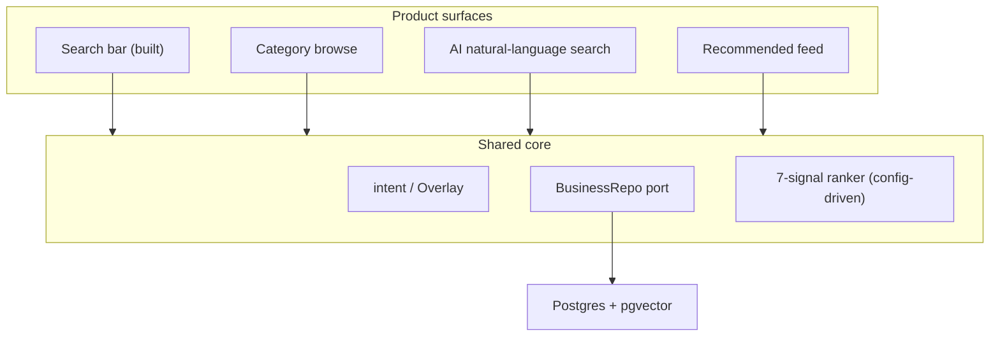

The spec's appendix describes where this engine is headed. The full product
eventually powers four surfaces (a search bar, category browse, AI natural-language
search, and a recommended feed), plus a per-user learning loop and logging
infrastructure. The instruction was to "build it so the rest could plug in later".
This page is for an engineer who would build the next surface, and it maps each
future piece onto a seam that already exists.

<Note>
**Built today**: the search bar surface and the retrieval-and-ranking core. The
other three surfaces, the learning loop, and the logging pipeline are
**aspirational** and described here as extension points, not shipped features.
</Note>

## The four surfaces



All four surfaces share the same retrieval and ranking core. They differ only in
what overlay they pass in and what they do with the ranked list. The seams below
are what make that true.

### Search bar (built)

The current surface. A debounced query goes to `GET /search`, which runs
intent extraction, one retrieval round-trip, and the re-ranker, and returns the
top 15. Everything else reuses these pieces.

### Category browse

Browsing a category ("show me all the spas in Brickell") is search with an empty
text query and a pre-set overlay. The `domain.Overlay` already carries a
`CategoryFilter`, `SubcategoryFilter`, and `PriceFilter`. The recall function
already accepts these as parameters. To build category browse:

<Steps>
  <Step title="Construct an Overlay directly">
    Instead of deriving the overlay from query text via `intent.Extract`, build it
    from the browse selection (category, optional subcategory, optional price).
  </Step>
  <Step title="Reuse retrieval and ranking unchanged">
    Pass the overlay into the same `BusinessRepo.Search`. The seven-signal ranker
    orders the result by the same rules, so a browsed category list is ranked, not
    just filtered. No new ranking code.
  </Step>
  <Step title="Page it">
    Raise the limit and add an offset (an additive change to `SearchOpts`); the
    response contract permits new fields without breaking clients.
  </Step>
</Steps>

### AI natural-language search

A richer natural-language surface ("a quiet place to take my parents for brunch
near the water") generalizes the existing intent layer. There are two clean ways
to plug it in, both behind the existing seams:

- **Today's path**: the semantic recall channel (already built, flag-gated) plus
  the lexicon already handle vibe and structured intent. A natural-language
  surface can lean on these directly: embed the query, blend vector recall, and
  let the lexicon catch the structured cues.
- **The richer path**: replace `intent.Extract` with an LLM that emits the same
  `domain.Overlay` struct. Because the overlay is the contract between intent and
  retrieval, an LLM-driven extractor is a drop-in: parse the sentence into
  category, tags, price, and open-now, hand back an `Overlay`, and the rest of the
  pipeline is untouched. The ranker and the SQL never learn that a model produced
  the filters.

The discipline that makes this safe: intent only narrows the candidate set; it
never overrides archetype and never adds a ranking signal. So a smarter intent
layer cannot accidentally rewrite the scoring contract.

### Recommended feed

A feed is search with no query at all: rank the whole (or a regionally filtered)
candidate set for a given user and context. The architecture supports this
because:

- The **ranker is pure and config-driven**. A feed can run the same seven-signal
  sum with a feed-specific weight profile in `config/ranking.yaml`, no code
  change.
- The **API is stateless**. A feed request is just another `SearchOpts` (location,
  time, and later a user id); any instance can serve it.
- The **retrieval port** can return a broad candidate set ordered by raw signals,
  which the ranker then personalizes.

The one new piece a feed wants is diversity (so the feed is not ten coffee chains)
and personalization (so it reflects the user). Both are covered under
[Future improvements](/future).

## The per-user learning loop

A learning loop logs what users do and nudges the ranking over time. The
architecture is already shaped for it:

<CardGroup cols={2}>
  <Card title="Config-driven weights" icon="sliders">
    Archetype weights live in YAML, loaded at startup. A nightly job can rewrite
    that file (or a weights table) from click-through data and the API picks up
    new weights on restart. No ranker code changes.
  </Card>
  <Card title="Per-user signals via the repo port" icon="user">
    The friend signal is denormalized today, but the retrieval contract is built
    to add a user id. The ranking strategy ADR notes that a `user_id` parameter
    on the SQL function pulls friend joins and history inside the same round-trip,
    and the "raw signals out" contract does not change.
  </Card>
</CardGroup>

Concretely, to add a learning loop:

1. **Log** `(query, results, clicked, dwell)` from the API (the logging hook
   below).
2. **Aggregate** nightly into per-archetype or per-user weight adjustments.
3. **Apply** either by rewriting `config/ranking.yaml` (global tuning) or by
   adding a personalized signal that joins per-user history in the recall SQL (a
   new raw signal column, then a new entry in the config signal list).

Because every signal is a value in 0 to 1 multiplied by a weight, a learned signal
fits the existing sum without restructuring it.

## Logging infrastructure

Every `/search` request already emits a structured log line via `slog`, with the
query, location, result count, the per-stage timings, and a trace id:

```text
level=info msg=search q="sushi" lat=25.774 lng=-80.194 results=15
  intent_ms=0 sql_ms=18 rerank_ms=3 total_ms=27 trace_id=...
```

This is the foundation for both observability and the learning loop. Extending it
means adding a click-event endpoint and shipping these lines to a warehouse; the
request lifecycle is already instrumented, so the hook point exists.

## The general rule

Every extension above lands on one of three existing seams:

<CardGroup cols={3}>
  <Card title="The Overlay" icon="filter">
    New ways to narrow the candidate set (browse selections, LLM-parsed
    sentences) become a `domain.Overlay`, and retrieval already consumes it.
  </Card>
  <Card title="The BusinessRepo port" icon="plug">
    A different retrieval engine (Meilisearch, a feed-specific query, a per-user
    join) implements the same interface, and the ranker never changes.
  </Card>
  <Card title="The config-driven ranker" icon="gear">
    New weight profiles, learned weights, or a feed mode are YAML edits, not code
    branches.
  </Card>
</CardGroup>

If a new feature does not fit one of these seams, that is the signal it needs a
new port, which is exactly how a cache or a second engine would enter the system.
