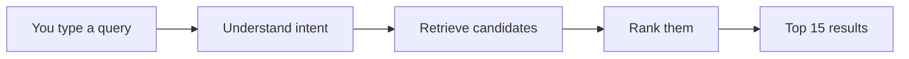

Every time you type a letter, Lemon Search runs the same four-step pipeline. It
is small on purpose: fewer moving parts means it stays fast and predictable.

<Steps>
  <Step title="Understand intent">
    Before searching, the engine reads the query for meaning. "cheap" becomes a
    price filter. "open now" becomes a time filter. "chill place to work" becomes
    a vibe that a small language model can match against. This step takes under a
    millisecond for keyword cues and only adds a few milliseconds when the vibe
    model is needed.
  </Step>
  <Step title="Retrieve candidates">
    The database does one round-trip and returns up to 150 plausible businesses.
    This pass is about being forgiving and wide: it tolerates typos, matches
    partial names, respects the intent filters, and (for vibe queries) pulls in
    semantically similar businesses. It returns the raw facts about each
    candidate (how far away, how many reviews, whether it is open) but does not
    decide the order.
  </Step>
  <Step title="Rank them">
    Now the engine scores each candidate on seven signals and sorts. The same
    business is weighted differently depending on what it is: distance matters a
    lot for a tow truck and far less for a wedding photographer. If you typed an
    exact business name, that business is pinned to the top regardless of its
    score.
  </Step>
  <Step title="Return the top 15">
    The best 15 results come back as JSON, along with a per-stage timing
    breakdown so we can always see where the time went.
  </Step>
</Steps>

## The one idea that holds it together

The single most important design choice is the **seam between retrieval and
ranking**:

<Note>
**The database finds and describes. The application decides the order.**
The database returns rich raw facts about each candidate. A small, pure piece of
code in the application composes those facts into a score. Neither side does the
other's job.
</Note>

This separation is what keeps the system both fast and easy to reason about. The
search engine can be swapped or tuned without touching the ranking math, and the
ranking math can be unit-tested on made-up examples without ever touching a
database. The two halves evolve independently.

## A worked example

Take the query **"joes barbr near me open now"**:

1. **Intent** notices "open now" and adds a require-open filter.
2. **Retrieval** runs a typo-tolerant name search, finds Joe's Barber Shop
   despite the misspelling, and pulls nearby open barbershops as backup.
3. **Ranking** recognizes that the query is an exact (if misspelled) business
   name and pins Joe's Barber Shop at position one. The rest of the list is
   ranked barbershops, closest and best-rated first.
4. **Result**: Joe's Barber Shop at the top, then the next best nearby open
   options, all in roughly 25 to 30 milliseconds.

Read on for the technical detail: [Architecture](/architecture) explains the
structure, [Ranking explained](/ranking) covers the scoring, and
[Smart intent and semantic search](/intent-and-semantic) covers how meaning is
extracted.
