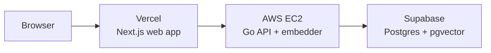

The system runs on three deploy targets, each owning one piece. They are chosen so
the API and database sit in the same AWS region for a sub-10ms hop between them.

## The three targets

| Target | Hosts | Region |
|---|---|---|
| Supabase | Postgres 15 (the database, all state) | us-east-1 |
| AWS EC2 | The Go API binary plus the in-process embedder | us-east-1 |
| Vercel | The Next.js web app | edge (global) |

The EC2 box (a c7i.xlarge, 4 vCPU / 8 GB) and Supabase both live in us-east-1, so
the Go-to-database hop stays at or under 10ms. The web app is served from Vercel's
edge, and the browser-to-API leg is the one network hop with real variance.

The runnable scripts live in the repo under
[deploy/](https://github.com/danielreales00/lemon-search/tree/main/deploy). The
deploy order is Supabase, then EC2, then Vercel.

<AccordionGroup>
  <Accordion title="Supabase">
    Create a Pro project (not Free, which auto-pauses) in us-east-1, apply the
    idempotent migrations, and seed the roughly 23,000 businesses plus their
    embeddings. A read-only `lemon_grader` role is created so graders can inspect
    schema and data, which is one of the spec's deliverables.
  </Accordion>
  <Accordion title="EC2">
    Launch the instance, run the provisioning script (it installs Go, the two
    native libraries for the in-process embedder, the embedding model, builds the
    API with the ORT build tag, and installs a systemd service), fill the runtime
    environment, and start. A Caddy front-end adds auto-renewing HTTPS so the
    Vercel page can call it.
  </Accordion>
  <Accordion title="Vercel">
    Import the repo with `web` as the root directory, set the API base URL, and
    push. Production deploys automatically on push to main. After it deploys, set
    the CORS origin on the API box to the Vercel URL.
  </Accordion>
</AccordionGroup>

For the full runbook, including the native-library recipe, TLS setup, rollback,
and emergency stop, see
[docs/operations/deployment.md](https://github.com/danielreales00/lemon-search/blob/main/docs/operations/deployment.md).

## How a deploy flows

Pushing to main runs CI (lint, test, build, migration idempotency, secret
scanning). A path-filtered workflow then SSHes to the box and runs the deploy
script (git pull, build with the ORT tag, restart the service); docs-only changes
do not trigger a redeploy. Vercel deploys the web app on the same push through its
own pipeline. The systemd unit uses restart-always, so a crash recovers
automatically.

## The speed story

Sub-100ms p95 on every keystroke is treated as a hard constraint, not a hope, and
it is measured rather than asserted.

<CardGroup cols={2}>
  <Card title="What a request costs" icon="stopwatch">
    A warm query is roughly 20 to 30ms of database CPU (the lexical rank plus
    open-status), about 2ms of embedding CPU on the API box (pooled), and a
    roughly 1ms HNSW vector probe. The vectors are nearly free; the cost is the
    lexical work.
  </Card>
  <Card title="Per-stage timings on every response" icon="chart-line">
    Every `/search` response carries `intent_ms`, `embed_ms`, `sql_ms`,
    `rerank_ms`, and `total_ms`. When latency moves, the response itself says
    which stage moved, so a slow p95 is attributed, not guessed.
  </Card>
</CardGroup>

### A real fix the load bench caught

Single-query spot checks looked fine, but an open-loop load bench (run from a
second in-region box against the deployed API) surfaced a p95 of about 146ms,
entirely from short one and two character prefixes. The stage split pinned it to
the database, and per-query timing pinned it to those short queries.

The root cause: trigram similarity is useless below three characters. A one-letter
query matches zero rows via the fuzzy path yet costs about 30ms to scan, and the
ranker then computed similarity for roughly 1,700 prefix matches, all wasted. The
fix gated the trigram recall and similarity term to queries of three characters or
more, and the web app does not fire until the second keystroke. Single-query p95
dropped from about 146ms to about 80ms, under target, with the correctness bench
unchanged for queries of three characters or more.

### Where the remaining ceiling is

Under sustained concurrent load the wall is the database's CPU, not the API box.
The throughput knee sits where the database's two-core math predicts (around 80
requests per second), while the embed pool on the API box has far more headroom
(roughly 900 requests per second). Database CPU scales only at the larger compute
tiers, so the honest story is: name the wall, co-scale the database tier for a
ceiling run, then scale back down. The load bench attributes this cleanly because
it records the SQL and embed split per request. See
[docs/bench/plan.md](https://github.com/danielreales00/lemon-search/blob/main/docs/bench/plan.md).
